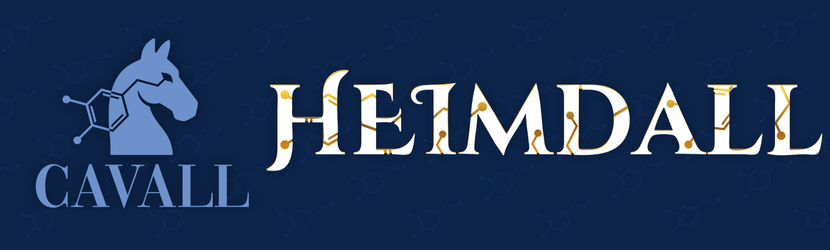

<div align="center">
  

  # Heimdall
  **Deterministic chemical structure extraction via Ketcher.**
  
  [](https://opensource.org/licenses/BSD-3-Clause)
  [](docs/architecture.md)
</div>

---

Give Heimdall an image or a PDF of drawn chemical structures and get back
SMILES - with **Ketcher as the source of truth, never free-styled LLM
SMILES**

Unlike standard multimodal models that attempt to generate SMILES strings from memory-often resulting in hallucinations-Heimdall uses a strict, multi-step validation pipeline. A multimodal agent transcribes the visible marks (atoms, bonds, rings, wedges), a backend interprets that transcription into a chemical graph, and **Ketcher** exports the SMILES. 

> The model never types a SMILES from memory or predicts "what this molecule should be." Every SMILES string that leaves Heimdall is structurally verified and emitted by Ketcher. 

Heimdall ships as a portable **stdio MCP server** paired with three intelligent agent **skills**, natively supporting Claude Code, Cursor, and Codex.

---

## Contents

1. [Core Capabilities](#core-capabilities)
2. [Installation](#installation)
   - [Claude Code](#claude-code)
   - [Cursor](#cursor)
   - [Codex](#codex)
   - [Zed](#zed)
   - [OpenCode](#opencode)
3. [Advanced Configuration](#advanced-configuration)
   - [The Indigo Shim (Canonical SMILES & Stereo)](#the-indigo-shim-canonical-smiles--stereo)
   - [Concurrency & Batch Processing](#concurrency--batch-processing)
4. [Model Selection Guidelines](#model-selection-guidelines)
5. [License & Attributions](#license--attributions)

---

## Core Capabilities

Heimdall introduces three distinct skills to your agent's toolkit. For a comprehensive look at the MCP tool surface, review the [`Tool Reference`](docs/tool-reference.md).

*   **`heimdall-image-rebuild`**
    Reconstructs a single molecule from an image by transcribing visible pixel facts, exporting the exact SMILES generated by Ketcher.
*   **`heimdall-pdf-extract`**
    Scans a PDF (such as a paper, preprint, or supplementary information), locates and crops each drawn structure, and routes every crop through `heimdall-image-rebuild`.
*   **`heimdall-ingest`**
    Loads a molecule from an existing SMILES string or molfile, returning canonical exports along with detailed atom and bond tables.

---

## Installation

Heimdall is **skills + MCP server**. Every path needs both; what varies is whether
you get them from a **marketplace/plugin install** (no clone) or by **cloning the
repo**.

| Platform | No clone - available now | No clone - after marketplace approval | Clone always works |
|----------|--------------------------|---------------------------------------|--------------------|
| **Claude Code** | Self-host plugin (below) | [Claude community directory](https://claude.com/docs/plugins/submit) → `heimdall@claude-community` | `git clone` + `--plugin-dir` |
| **Cursor** | Manual MCP config (skills still need clone or marketplace) | [Cursor marketplace](https://cursor.com/marketplace) or [cursor.directory](https://cursor.directory) - skills + MCP bundled | `git clone` + open in Cursor |
| **Codex** | Plugin marketplace CLI (below) | *(no official listing yet)* | `git clone` + open in Codex |

The MCP server binary always comes from npm on first use:
`npx -y @cavall/heimdall-mcp-server` (published package, not embedded in skills).

### Prerequisites

**Node.js ≥ 18** is required. npm and npx are bundled with it — no separate install needed.

- Check: `node --version` and `npx --version`
- Install (if missing): [nodejs.org/en/download](https://nodejs.org/en/download) or via [nvm](https://github.com/nvm-sh/nvm)

**Chromium** (~150 MB) is downloaded automatically — but *not* during install, so the MCP connection handshake is never blocked. Installation stays fast (just the package), and the server downloads Chromium **lazily, on first use**, in the background. While that download runs (1-5 minutes, one time only), tool calls return a clear `BROWSER_INITIALIZING` message asking the agent to **retry shortly** — this is normal. Once the browser is cached the first time, every later start is fast.

To **pre-warm** Chromium (e.g. baking a Docker image or seeding a CI cache) so the very first tool call is instant, run once from the package directory:

```bash
npm run setup      # or: npx playwright install chromium
```

To skip the automatic download entirely (offline environments, CI, pre-seeded caches), add `HEIMDALL_SKIP_BROWSER=1` to the server's `env` block in your MCP config:

```json
"env": { "KETCHER_AGENT_MODE": "auto", "HEIMDALL_SKIP_BROWSER": "1" }
```

With that set, the server will not download Chromium and instead errors clearly on first tool use if no browser is pre-seeded.

---

### Claude Code

#### No clone - available now (self-host marketplace)

Works immediately; no review. Installs **skills + MCP** (`.mcp.json` loads the
server automatically).

Inside Claude Code, run these slash commands (not terminal commands):

```
/plugin marketplace add CAVALL-ORG/Heimdall
/plugin install heimdall@heimdall
```

The `@heimdall` suffix is the plugin `name` in `.claude-plugin/marketplace.json`.

#### No clone - after community directory approval

Once listed in Anthropic’s community catalog, inside Claude Code:

```
/plugin marketplace add anthropics/claude-plugins-community
/plugin install heimdall@claude-community
```

#### Clone (always works)

```bash
git clone https://github.com/CAVALL-ORG/Heimdall
cd Heimdall
claude --plugin-dir .
```

---

### Cursor

#### No clone - after marketplace approval *(pending)*

When Heimdall appears in the **Cursor marketplace** or on **cursor.directory**,
install from the marketplace panel in Cursor. The plugin bundles **skills** and
**MCP config** (`mcp.json`) - no clone, no manual JSON.

#### No clone - manual MCP only *(available now; skills still need clone or marketplace)*

Add the MCP server globally or per-project. This gives you **tools only** - not
the Heimdall skills - until you install the marketplace plugin or clone.

Add to `.cursor/mcp.json` (project or global):

```json
{
  "mcpServers": {
    "heimdall": {
      "command": "npx",
      "args": ["-y", "@cavall/heimdall-mcp-server"],
      "env": { "KETCHER_AGENT_MODE": "auto" }
    }
  }
}
```

Or use the one-click deeplink (same MCP config):

```text
cursor://anysphere.cursor-deeplink/mcp/install?name=heimdall&config=eyJjb21tYW5kIjoibnB4IiwiYXJncyI6WyIteSIsIkBjYXZhbGwvaGVpbWRhbGwtbWNwLXNlcnZlciJdLCJlbnYiOnsiS0VUQ0hFUl9BR0VOVF9NT0RFIjoiYXV0byJ9fQ==
```

Generate the same block from a clone with `scripts/print-mcp-config.sh cursor`.

#### Clone (always works - skills + optional repo MCP)

```bash
git clone https://github.com/CAVALL-ORG/Heimdall
cd Heimdall
```

Open the folder in Cursor. Skills auto-load from `.agents/skills/`.

If you have not installed via the marketplace plugin, add the MCP server manually. Create (or add to) `.cursor/mcp.json`:

```json
{
  "mcpServers": {
    "heimdall": {
      "command": "npx",
      "args": ["-y", "@cavall/heimdall-mcp-server"],
      "env": { "KETCHER_AGENT_MODE": "auto" }
    }
  }
}
```

---

### Codex

Requires **Codex ≥ 0.34**. There is **no Codex marketplace listing** to submit to
yet (unlike Claude and Cursor).

#### No clone - available now (plugin marketplace CLI)

One-time local setup. Installs **skills + MCP** without cloning:

```bash
codex plugin marketplace add CAVALL-ORG/Heimdall
codex plugin install heimdall@heimdall
codex mcp add heimdall -- npx -y @cavall/heimdall-mcp-server
```

#### Clone (always works)

```bash
git clone https://github.com/CAVALL-ORG/Heimdall
cd Heimdall
codex mcp add heimdall -- npx -y @cavall/heimdall-mcp-server
```

Skills auto-load from `.agents/skills/`. The repo includes `.codex/config.toml`
for repo-scoped MCP — this file is only read when the project is marked **trusted**
in `~/.codex/config.toml`. If you use the clone path and skip `codex mcp add`,
add a trust entry or Codex will silently ignore the repo config:

```toml
# ~/.codex/config.toml
[[trusted_projects]]
path = "/path/to/Heimdall"
```

---

### Zed

Zed's URL importer is the reliable install path on all platforms

#### No clone - URL import *(available now, all platforms)*

Open the command palette (`Ctrl+Shift+P` / `Cmd+Shift+P`), run `agent: create skill from url`, and import each URL below one at a time. **Set the scope**  
**toggle to Global (recommended)** - the dialog defaults to Project scope, which  
limits the skill to the current folder.

```
https://github.com/CAVALL-ORG/Heimdall/blob/main/skills/heimdall-image-rebuild/SKILL.md
https://github.com/CAVALL-ORG/Heimdall/blob/main/skills/heimdall-pdf-extract/SKILL.md
https://github.com/CAVALL-ORG/Heimdall/blob/main/skills/heimdall-ingest/SKILL.md
```

**Verify:** Go to Settings or Press `Ctrl+,` → **AI → Skills → User** , you should see all three Heimdall skills

Add the MCP server. Open `zed: open settings` from the command palette and merge the `"context_servers"` block into your existing config:

```json
{
  "context_servers": {
    "heimdall": {
      "command": {
        "path": "npx",
        "args": ["-y", "@cavall/heimdall-mcp-server"]
      },
      "settings": {
        "KETCHER_AGENT_MODE": "auto"
      }
    }
  }
}
```

#### Clone

```bash
git clone https://github.com/CAVALL-ORG/Heimdall
```

**macOS / Linux:**

```bash
mkdir -p ~/.agents/skills
cp -r Heimdall/skills/heimdall-* ~/.agents/skills/
```

**Windows (PowerShell):**

```powershell
"heimdall-image-rebuild","heimdall-pdf-extract","heimdall-ingest" | ForEach-Object {
    New-Item -ItemType Directory -Force "$env:USERPROFILE\.agents\skills\$_"
    Invoke-WebRequest "https://raw.githubusercontent.com/CAVALL-ORG/Heimdall/main/skills/$_/SKILL.md" `
        -OutFile "$env:USERPROFILE\.agents\skills\$_\SKILL.md"
}
```

Add the MCP server. Open `zed: open settings` from the command palette and merge the `"context_servers"` block into your existing config:

```json
{
  "context_servers": {
    "heimdall": {
      "command": {
        "path": "npx",
        "args": ["-y", "@cavall/heimdall-mcp-server"]
      },
      "settings": {
        "KETCHER_AGENT_MODE": "auto"
      }
    }
  }
}
```

Generate the config block from a clone with `scripts/print-mcp-config.sh zed`.

---

### OpenCode

> OpenCode runs as a single-agent loop - it does not spawn subagents. The  
> fan-out parallelism in `heimdall-pdf-extract` executes as batched sequential  
> waves. For dense PDFs, run three server instances to distribute the canvas  
> call budget (see Clone section below).

#### No clone *(available now)*

**macOS / Linux:**

```bash
for skill in heimdall-image-rebuild heimdall-pdf-extract heimdall-ingest; do
  mkdir -p ~/.agents/skills/$skill
  curl -fsSL "https://raw.githubusercontent.com/CAVALL-ORG/Heimdall/main/skills/$skill/SKILL.md" \
    -o ~/.agents/skills/$skill/SKILL.md
done
```

**Windows (PowerShell):**

```powershell
"heimdall-image-rebuild","heimdall-pdf-extract","heimdall-ingest" | ForEach-Object {
    New-Item -ItemType Directory -Force "$env:USERPROFILE\.agents\skills\$_"
    Invoke-WebRequest "https://raw.githubusercontent.com/CAVALL-ORG/Heimdall/main/skills/$_/SKILL.md" `
        -OutFile "$env:USERPROFILE\.agents\skills\$_\SKILL.md"
}
```

Add the MCP server. Open or create `~/.config/opencode/opencode.json`  
(macOS/Linux) or `%USERPROFILE%\.config\opencode\opencode.json` (Windows):

```json
{
  "mcp": {
    "heimdall": {
      "type": "local",
      "command": ["npx", "-y", "@cavall/heimdall-mcp-server"],
      "enabled": true,
      "environment": { "KETCHER_AGENT_MODE": "auto" }
    }
  }
}
```

Restart OpenCode after saving.

**Slash commands (optional but recommended).** Skills are available via `/skills` by default.  
To register `/heimdall-image-rebuild`, `/heimdall-pdf-extract`, and  
`/heimdall-ingest` as first-class slash commands, paste this into OpenCode:

```
Create slash commands for the three Heimdall skills so I can invoke them with
/heimdall-image-rebuild, /heimdall-pdf-extract, and /heimdall-ingest. Save them
to the global OpenCode commands directory for this OS.
```

**OR**

**macOS / Linux:**

```bash
mkdir -p ~/.config/opencode/commands

printf -- '---\nname: heimdall-image-rebuild\ndescription: Extract SMILES from a molecule image using Heimdall\n---\nUse the heimdall-image-rebuild skill to extract the SMILES from the attached image.\n' > ~/.config/opencode/commands/heimdall-image-rebuild.md
printf -- '---\nname: heimdall-pdf-extract\ndescription: Extract all molecule structures from a PDF using Heimdall\n---\nUse the heimdall-pdf-extract skill to extract all drawn molecule structures from the attached PDF.\n' > ~/.config/opencode/commands/heimdall-pdf-extract.md
printf -- '---\nname: heimdall-ingest\ndescription: Load a molecule from SMILES or molfile using Heimdall\n---\nUse the heimdall-ingest skill to load the molecule and return canonical exports and atom/bond tables.\n' > ~/.config/opencode/commands/heimdall-ingest.md

```

**Windows (PowerShell):**

```powershell
New-Item -ItemType Directory -Force "$env:USERPROFILE\.config\opencode\commands"

Set-Content "$env:USERPROFILE\.config\opencode\commands\heimdall-image-rebuild.md" "---`nname: heimdall-image-rebuild`ndescription: Extract SMILES from a molecule image using Heimdall`n---`nUse the heimdall-image-rebuild skill to extract the SMILES from the attached image." -Encoding UTF8
Set-Content "$env:USERPROFILE\.config\opencode\commands\heimdall-pdf-extract.md" "---`nname: heimdall-pdf-extract`ndescription: Extract all molecule structures from a PDF using Heimdall`n---`nUse the heimdall-pdf-extract skill to extract all drawn molecule structures from the attached PDF." -Encoding UTF8
Set-Content "$env:USERPROFILE\.config\opencode\commands\heimdall-ingest.md" "---`nname: heimdall-ingest`ndescription: Load a molecule from SMILES or molfile using Heimdall`n---`nUse the heimdall-ingest skill to load the molecule and return canonical exports and atom/bond tables." -Encoding UTF8

```

#### Clone

```bash
git clone https://github.com/CAVALL-ORG/Heimdall
cd Heimdall
```

Skills auto-load from `.agents/skills/` when running inside the cloned folder.  
For global availability, copy to `~/.agents/skills/` using the commands above.

Add the MCP server as shown above, or generate the block from a clone with  
`scripts/print-mcp-config.sh opencode`.

**Batch processing (high-volume PDFs).** Run three isolated server instances to  
distribute the canvas call budget across concurrent crops:

```json
{
  "mcp": {
    "heimdall":   { "type": "local", "command": ["npx", "-y", "@cavall/heimdall-mcp-server"], "enabled": true, "environment": { "KETCHER_AGENT_MODE": "auto" } },
    "heimdall-2": { "type": "local", "command": ["npx", "-y", "@cavall/heimdall-mcp-server"], "enabled": true, "environment": { "KETCHER_AGENT_MODE": "auto" } },
    "heimdall-3": { "type": "local", "command": ["npx", "-y", "@cavall/heimdall-mcp-server"], "enabled": true, "environment": { "KETCHER_AGENT_MODE": "auto" } }
  }
}
```
---

## Advanced Configuration (Optional)

### Indigo Shim (Canonical SMILES & Stereo)

By default, Heimdall's MCP server runs purely on Node.js in **standalone mode**. In this mode, Heimdall returns valid SMILES, but they are **non-canonical** and **CIP/wedge stereo may remain unresolved**. Standalone exports include an advisory warning indicating this degraded path.

To unlock canonical SMILES and full CIP/wedge stereo perception, you must configure the optional Python-based Indigo shim.

**1. Set up a virtual environment and install Indigo:**

```bash
python3 -m venv .indigo-venv
.indigo-venv/bin/pip install epam.indigo
```

**2. Point Heimdall to the configured interpreter:**

```bash
export HEIMDALL_PYTHON="$PWD/.indigo-venv/bin/python"
```

Once configured, the platform environments (which use `KETCHER_AGENT_MODE=auto`) will detect the wheel and automatically start a local Indigo shim, empowering Ketcher's V2000 solver to process canonical SMILES and stereo perception.

### Concurrency & Batch Processing

For interactive, one-at-a-time usage, a single server instance is optimal (configured by default in the platform blocks above). 

To process high-volume tasks, such as extracting an entire PDF of structures, you can generate a small pool of isolated servers to handle requests concurrently:

```bash
scripts/print-mcp-config.sh cursor --servers 3
```

Each server operates in strict isolation. The pool is intentionally capped at 3 instances to maintain stable parallel Chromium startup. For deeper insights into throughput limitations, consult the Concurrency section in [`docs/architecture.md`](docs/architecture.md).

---

## Model Selection Guidelines

Heimdall's accuracy scales directly with the reasoning capabilities of the underlying vision model your client employs. 

*   **Complex Structures (Strong Models):**
    For dense or fused ring systems, multiple stereocenters, complex wedge/hash stereochemistry, or condensed glyphs (e.g., `OMe`, `Ph`, `Boc`), utilize a frontier model like **Claude Opus 4**.
*   **Simple Structures (Lighter Models):**
    For rapid processing of fundamental structures (single rings, ≤2 stereocenters, absent of shorthand glyphs), a highly efficient model like **Claude Sonnet 4** is recommended.

**Design Philosophy:** Accuracy strictly outranks speed. An incorrect SMILES string incurs a far higher technical debt than a marginally slower correct one. When an agent is processing a batch (like a PDF extraction), it will clearly communicate which model it is utilizing for specific tasks unless explicitly overridden by the user.

---

## License & Attributions

Heimdall is open-source software released under the **BSD 3-Clause License** (`BSD-3-Clause`; see [`LICENSE`](LICENSE)). You may use, modify, and redistribute it, including in proprietary and closed-source products, provided you retain the copyright notice and disclaimer.

Third-party dependencies are consumed unmodified under their own licenses: Ketcher, Indigo, Playwright and sharp under Apache-2.0, and the libvips native library bundled by sharp (`@img/sharp-libvips-*`) under LGPL-3.0-or-later. Detailed attributions are in the [`NOTICE`](NOTICE) file.
